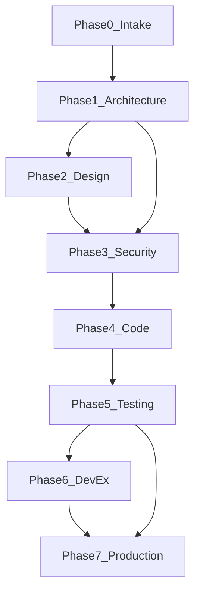

# Modelo de ciclo de vida universal

8 fases con gates estrictos. Las fases condicionales se omiten explícitamente en el orquestador generado.

## Fases y gates

| Fase | ID | Agente | Gate de salida | Bloqueante si |
|------|----|--------|----------------|---------------|
| 0 Intake | `intake` | `scope-auditor` | APROBADO | Alcance ambiguo, premisas no validadas |
| 1 Arquitectura | `architecture` | `architecture-auditor` | APROBADO | Patrones inconsistentes, contratos rotos |
| 2 Diseño/UX | `design` | `design-auditor` | APROBADO | A11y crítica, tokens rotos (condicional) |
| 3 Seguridad | `security` | `security-auditor` | APROBADO | Hallazgo crítico o alto sin mitigación |
| 4 Implementación | `code` | `code-auditor` | APROBADO | Convenciones violadas, deuda bloqueante |
| 5 Testing | `test` | `test-auditor` | APROBADO | Tests fallan o cobertura insuficiente |
| 6 DevEx | `devex` | `devex-auditor` | APROBADO | CI roto, onboarding imposible (condicional) |
| 7 Producción | `production` | `production-auditor` | GO / NO-GO | Build falla, regresión visual, runtime errors |

## Reglas de oro

1. **No saltar fases** — si una fase devuelve BLOQUEADO, el pipeline se detiene.
2. **Seguridad antes de merge** — Fase 3 debe aprobar antes de considerar la feature lista para producción.
3. **QA rebota a la raíz** — un fallo en Fase 5 determina el equipo/fase de corrección, no se avanza a Fase 7.
4. **Solo el orquestador emite GO/NO-GO** — los auditores emiten APROBADO/BLOQUEADO de su fase.

## Matriz de rebotes

| Tipo de defecto | Fase de reinicio | Agente |
|-----------------|------------------|--------|
| Requisitos/alcance incorrecto | 0 Intake | scope-auditor |
| Arquitectura/contratos rotos | 1 Arquitectura | architecture-auditor |
| UI/UX/a11y bloqueante | 2 Diseño | design-auditor |
| Vulnerabilidad de seguridad | 3 Seguridad | security-auditor |
| Bug de implementación | 4 Implementación | code-auditor |
| Tests fallidos | 5 Testing | test-auditor |
| CI/DX roto | 6 DevEx | devex-auditor |

Tras un rebote, las fases intermedias deben re-validar (especialmente Seguridad y Testing).

## Separación dominio vs auditoría

| Tipo | Ejemplos | Rol |
|------|----------|-----|
| Agentes de dominio | market-analyst, pine-developer | Ejecutan trabajo del negocio |
| Agentes de auditoría | security-auditor, test-auditor | Verifican calidad por fase |
| Orquestador | project-orchestrator | Coordina auditores, emite GO/NO-GO |

Los agentes de dominio **no reemplazan** a los auditores. El orquestador generado debe documentar ambos.

## Diagrama

Nota: Phase 2 (Design) y Phase 6 (DevEx) son opcionales según el perfil de stack.
